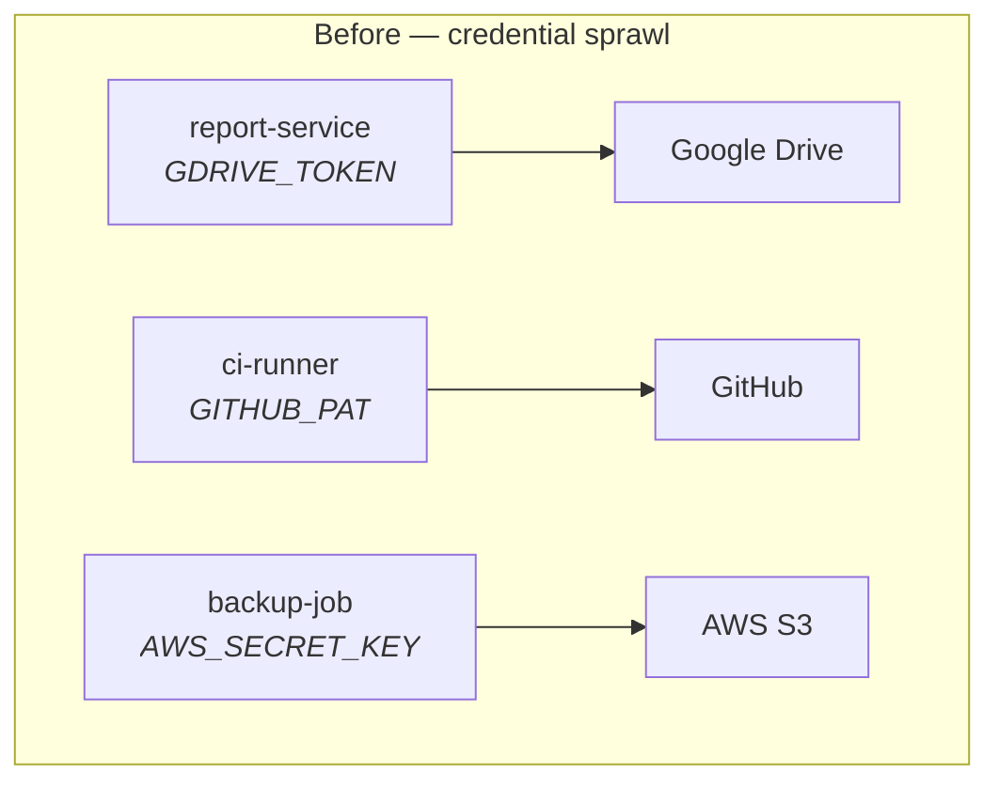
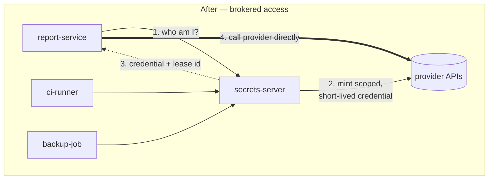
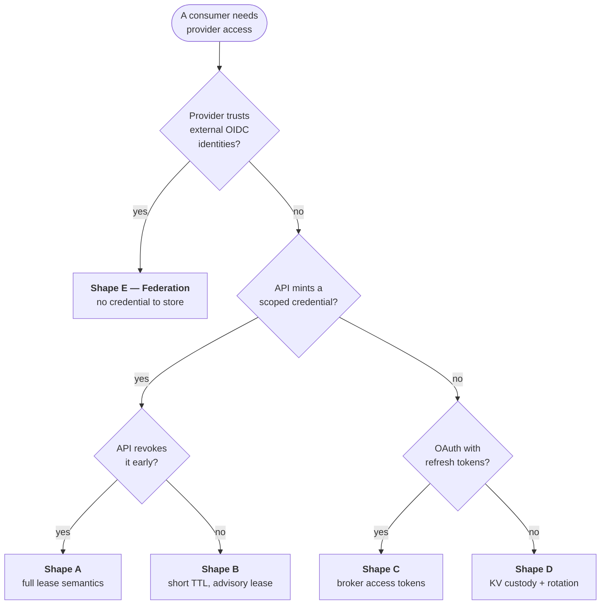
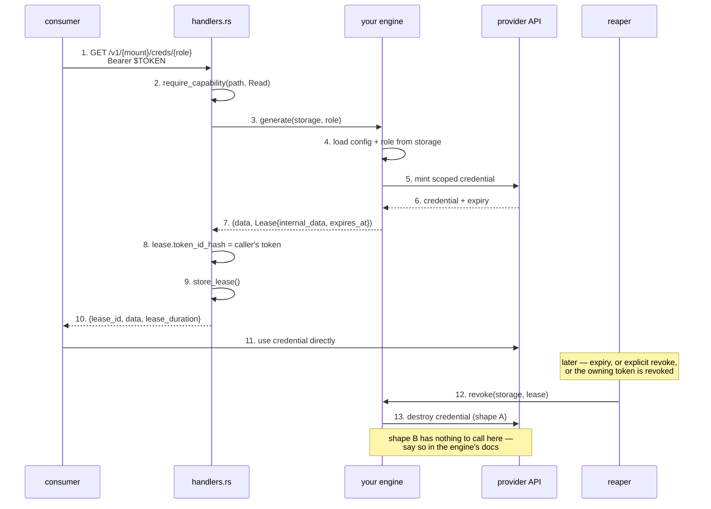

# Delegating third-party access to a microservice

How a consuming service gets access to GitHub, GitLab, AWS, Google Cloud
Storage, Google Workspace, Dropbox or Microsoft 365 **without holding a
long-lived credential of its own**.

- [The problem](#the-problem)
- [Five shapes of delegation](#five-shapes-of-delegation)
- [Choosing a shape](#choosing-a-shape)
- [How a shape becomes an engine](#how-a-shape-becomes-an-engine)
- [Path and policy conventions](#path-and-policy-conventions)
- [Per-provider guides](#per-provider-guides)
- [Asking the server instead](#asking-the-server-instead)

## The problem

The naive setup puts a long-lived provider token in every consumer's
environment:



Every box holding a credential is a box that can leak one, and none of them
can be revoked without knowing who holds what. The target:



The consumer authenticates as *itself* (an OIDC workload token, or a
`userpass` identity), policy decides which providers and which scopes it may
reach, and what it receives expires on its own. The server keeps the only
durable secret, in one place, encrypted, with one audit trail.

## Five shapes of delegation

Providers differ enormously in what they will let you mint, and — more
importantly — in whether they will let you *un*-mint it. That single
difference is what decides how much a lease can actually promise, so it is
worth naming the shapes before the providers.

| | Shape | Server stores | Consumer receives | Revocable on demand? |
|---|---|---|---|---|
| **A** | Mint & revoke | a root credential | short-lived scoped credential | yes — provider API |
| **B** | Mint, expiry-only | a root credential | short-lived scoped credential | no — TTL is the only control |
| **C** | Refresh broker | a long-lived refresh token | short-lived access token | partly — kill the refresh token |
| **D** | Static custody | the credential itself | the credential itself | only by rotating at the provider |
| **E** | Federation | *nothing* | nothing from us — it federates directly | provider-side trust config |

**A — Mint & revoke** is the ideal and the shape `secrets-engine-postgres`
already implements: `generate()` mints, `revoke()` destroys, and a lease
expiry is a real guarantee because the reaper can enforce it.

**B — Mint, expiry-only** looks identical from the consumer's side, but the
lease is *advisory*: once a bearer token is issued, most cloud providers have
no way to invalidate that specific token. Revoking such a lease deletes our
record of it and stops renewal; the credential itself keeps working until it
expires. Documenting that honestly matters more than hiding it — it is the
reason to ask for 15-minute credentials rather than 12-hour ones.

**C — Refresh broker** is the OAuth reality for most SaaS. Nothing about the
long-lived half is mintable, so the server holds the refresh token and hands
out only short access tokens. The consumer never sees the durable secret,
which is most of the benefit; revocation works at the refresh-token level,
which kills future issuance rather than current tokens.

**D — Static custody** is the fallback when a provider offers no programmatic
minting at all. This is the KV engine, and the honest framing is that the
server is a well-audited lockbox, not a broker.

**E — Federation** is the strongest outcome and the one to reach for first:
the provider is configured to trust the consumer's *own* identity, so no
credential exists to store, hand over or leak. It is also the one that needs
the most provider-side setup, and it fails the moment a provider does not
speak OIDC federation.

## Choosing a shape



Shape E is worth a second look even when a provider also supports A: it
removes the root credential entirely, and a root credential is the one thing
in this architecture whose compromise is unbounded.

## How a shape becomes an engine

Shapes A and B are new `SecretsEngine` implementations. The trait
(`crates/secrets-core/src/engine.rs`) already has the two methods that
matter, defaulting to `Unsupported` so static engines ignore them:

```rust
async fn generate(&self, storage: &dyn StorageBackend, role: &str)
    -> EngineResult<(serde_json::Value, Lease)>;

async fn revoke(&self, storage: &dyn StorageBackend, lease: &Lease)
    -> EngineResult<()>;
```

The lifecycle is already wired end to end; a new provider only fills in the
two provider-specific boxes:



Three things make this work, and all three are already in place:

- **`Lease.internal_data`** is free-form JSON, so the engine stores whatever
  `revoke()` will need — the Postgres engine keeps `username`/`db_name`; a
  GitHub engine would keep the installation id and token.
- **`Lease.expires_at`** drives both the reaper and the storage row's own
  expiry, so a lease cannot outlive its record.
- **`Lease.token_id_hash`** ties the credential to the consumer's token, so
  revoking that token cascades (`reaper::revoke_leases_for_token`).

Shapes C and D need no new engine at all — they are KV paths plus a policy.
Shape C additionally needs whoever holds the refresh token to be able to
*write back* a rotated one, which on this server means the `create`
capability (`secret_write` checks `Capability::Create`, not `Update`).

## Path and policy conventions

Follow the Postgres engine's three-mount layout, so every provider reads the
same way:

```
{provider}/config/{target}     # the root credential + endpoint  (Sudo)
{provider}/roles/{role}        # what a role may mint, and its TTL (Sudo)
{provider}/creds/{role}        # GET → mint + lease            (Read)
```

`{provider}/config` and `{provider}/roles` are the operator's surface and
should require `sudo`; only `{provider}/creds/{role}` is exposed to
consumers, one role per consumer, and policy grants `read` on exactly that
path:

```json
{
  "rules": [
    { "prefix": "github/creds/report-service", "capabilities": ["read"] }
  ]
}
```

Because policy is longest-prefix-match and deny-by-default
(`crates/secrets-core/src/policy.rs`), a consumer granted
`github/creds/report-service` cannot reach another role's credentials, the
role definitions, or the root credential.

For shapes C and D the equivalent convention under KV is:

```
secret/data/thirdparty/{provider}/{account}
```

## Per-provider guides

Each guide states the shape, the exact credential it mints, its TTL, what it
can be narrowed to, whether revocation does anything, what root credential
the server must hold, and the setup and request flows as diagrams.

Every mechanism here is implemented — see [`setup/`](setup/) for the operator
runbook for each, with the exact `config` and `roles` documents each engine
expects. [**Federation**](federation.md) gets its own deep dive, because it is
the shape worth reaching for first and the one whose setup decides whether it
is the safest option or the most dangerous.

| Guide | Best available shape | Shortest TTL | True revocation? |
|---|---|---|---|
| [GitHub](github.md) | **A** — App installation tokens | 1 h (fixed) | **yes** |
| [GitLab](gitlab.md) | **A** — project/group tokens | 1 day at the provider; ours can be shorter | **yes** |
| [AWS](aws.md) | **E**, else **B** — STS | 15 min | no — per-role only |
| [Google Cloud Storage](gcp-storage.md) | **E**, else **B** — impersonation + downscoping | 15 min | no (HMAC keys excepted) |
| [Google Workspace / Drive](google-workspace.md) | **C** — brokered access tokens | ~1 h | refresh token only |
| [Dropbox](dropbox.md) | **C** — brokered access tokens | 4 h (fixed) | yes, but destroys the authorisation |
| [Microsoft 365](microsoft-365.md) | **E**, else **B** — Graph | 10 min via policy | no — refresh tokens only |
| [**Federation**](federation.md) | **E** — no credential exists | n/a | n/a — nothing is issued |

Three patterns emerge across all seven. **Only GitHub gives a lease its full
meaning** — short, narrow, and revocable together. **The three big clouds all
refuse to revoke an issued bearer token**, so scope and TTL are the entire
containment story there, and all three offer a federation path that removes
the root credential instead. **The SaaS providers invert the problem**: the
durable half is revocable but nothing short-lived can be minted, so custody
of a refresh token is the value the server adds.

## Asking the server instead

None of this documentation has to be trusted to be current, because the
engines describe themselves:

```bash
GET /v1/sys/help          # every mounted engine, its shape, its revocability
GET /v1/{mount}/help      # one engine: mechanism, TTL, scoping, caveats
```

Both need only a valid token, no capability — a consumer holding nothing but
`read` on one `creds` path can still look up what its credential is worth.
And every minted credential carries a `_doc` block answering the same
questions for the specific thing it just received:

```json
"_doc": {
  "shape": "mint-expiry-only",
  "revocable": false,
  "revoke_effect": "nothing at the provider — the STS session remains valid until its expiry...",
  "scoped_to": ["bucket:reports", "prefix:report-service/", "inRole:roles/storage.objectViewer"],
  "expires_at": "2026-09-22T13:19:44Z",
  "help": "/v1/aws/help",
  "revoke": "/v1/sys/leases/revoke/8f14e45f-..."
}
```

`revocable` answers exactly one question — *if I revoke this lease, does my
credential stop working?* — and only shape A can answer yes. The server
asserts in its own test suite that no engine claims more than its shape
allows.
