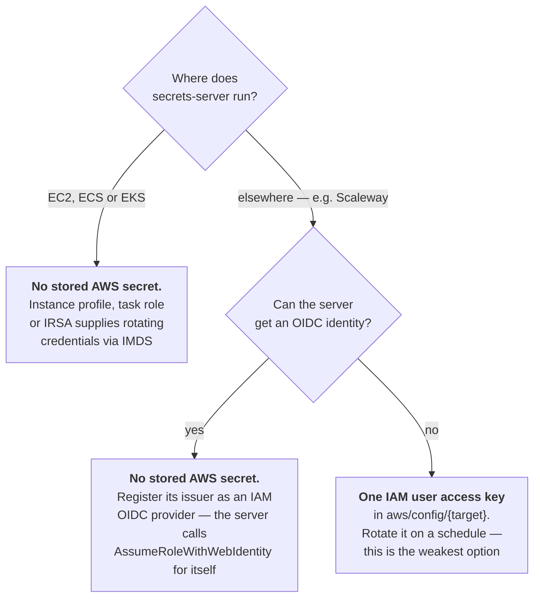
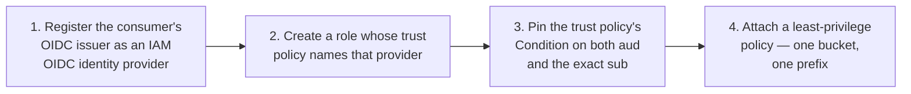
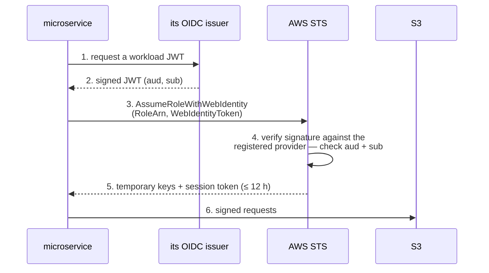
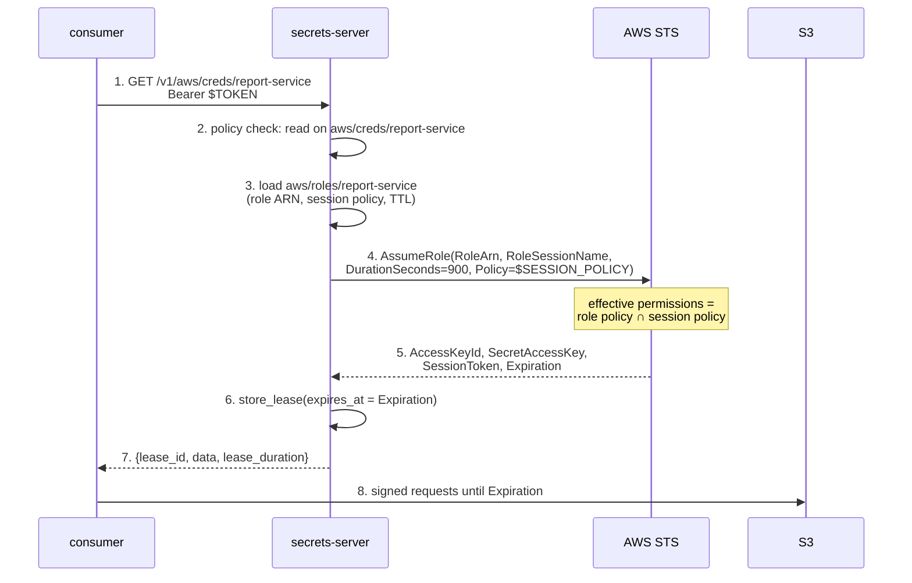
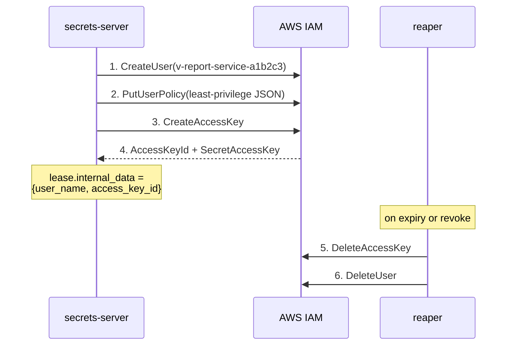
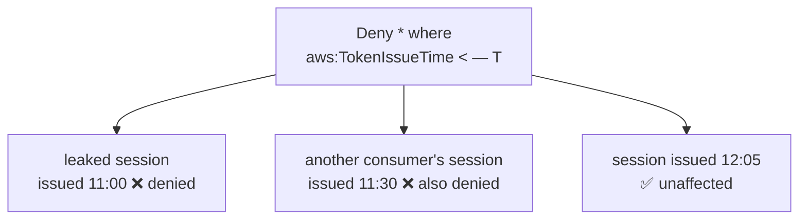

# AWS

Delegating S3 — or any other AWS service — to a consuming microservice.

AWS is the best-equipped provider in this set: it can mint scoped,
short-lived credentials on demand, and it can do so *without the server
holding any durable secret at all*. It is also the provider whose revocation
story is most often misunderstood, so read
[Revocation, honestly](#revocation-honestly) before promising anything.

- [Mechanisms at a glance](#mechanisms-at-a-glance)
- [What the server must hold](#what-the-server-must-hold)
- [Preferred — let the consumer federate](#preferred--let-the-consumer-federate-shape-e)
- [Brokered — AssumeRole with a session policy](#brokered--assumerole-with-a-session-policy-shape-b)
- [Engine sketch](#engine-sketch)
- [Alternative — a per-lease IAM user](#alternative--a-per-lease-iam-user-shape-a)
- [Revocation, honestly](#revocation-honestly)
- [Presigned URLs](#presigned-urls)
- [Gotchas](#gotchas)

## Mechanisms at a glance

| Mechanism | Shape | TTL | Scoping | Revocable early? |
|---|---|---|---|---|
| [`AssumeRoleWithWebIdentity`](https://docs.aws.amazon.com/STS/latest/APIReference/API_AssumeRoleWithWebIdentity.html) | **E** | 15 min – 12 h | session policy + role policy | no (per-role only) |
| [`AssumeRole`](https://docs.aws.amazon.com/STS/latest/APIReference/API_AssumeRole.html) | **B** | 15 min – 12 h | session policy + role policy | no (per-role only) |
| `CreateAccessKey` on a per-lease IAM user | **A** | none — lives until deleted | the user's policy | **yes** — `DeleteAccessKey` |
| [`GetFederationToken`](https://docs.aws.amazon.com/STS/latest/APIReference/API_GetFederationToken.html) | **B** | 15 min – 36 h | session policy *required* | no |
| [Presigned URL](https://docs.aws.amazon.com/AmazonS3/latest/userguide/using-presigned-url.html) | — | ≤ 7 days, or signer's session | one object, one method | no |

Two numbers govern every STS call: the requested `DurationSeconds` must fall
within 900–43200 **and** within the role's own `MaxSessionDuration` (1–12 h,
default 1 h). Exceeding the role's maximum fails the call rather than
truncating it. Role chaining — an assumed role assuming another role — caps
the result at 1 hour regardless.

## What the server must hold

This is the part worth designing carefully, because the root credential is
the one secret whose compromise is unbounded.



If the server runs on AWS compute, prefer the attached role: it needs **zero
stored AWS secret**, which is a stronger position than even the Postgres
engine manages (that one must hold a root database password).

## Preferred — let the consumer federate (shape E)

If the consuming microservice already has an OIDC identity — the same one it
uses to log in to this server — AWS can be taught to trust it directly. No
credential is minted, brokered or stored by anyone.

One-time setup:



Then, at runtime, this server is not in the path at all:



The call requires **no AWS credential whatsoever** — only a valid JWT. The
role this server plays shrinks to publishing which role ARN a given consumer
should assume, which is ordinary KV data rather than a secret.

The one trap: pin `sub` to the exact workload. A wildcard `sub`, or a
condition on `aud` alone, lets any identity from that issuer assume the role —
the classic confused-deputy misconfiguration. See
[Creating a role for OIDC](https://docs.aws.amazon.com/IAM/latest/UserGuide/id_roles_create_for-idp_oidc.html).

Note that a session obtained this way cannot call `GetFederationToken` or
`GetSessionToken`.

## Brokered — AssumeRole with a session policy (shape B)

When the consumer has no OIDC identity AWS can trust, the server brokers:
it assumes the role itself and passes the resulting session down.



The session policy is what makes this least-privilege. Permissions are the
**intersection** of the role's own policy and the session policy — a session
policy can only narrow, never add — so one broad role plus a per-consumer
session policy is a safe pattern:

```json
{
  "Version": "2012-10-17",
  "Statement": [
    { "Effect": "Allow", "Action": ["s3:GetObject", "s3:PutObject"],
      "Resource": "arn:aws:s3:::reports-bucket/report-service/*" },
    { "Effect": "Allow", "Action": "s3:ListBucket",
      "Resource": "arn:aws:s3:::reports-bucket",
      "Condition": { "StringLike": { "s3:prefix": "report-service/*" } } }
  ]
}
```

Up to 10 managed `PolicyArns` may be passed alongside the inline policy. Use
`ExternalId` when assuming a role in an account you do not control, and
session tags (needing `sts:TagSession` in the trust policy) when you want the
session distinguishable later — see [Revocation, honestly](#revocation-honestly)
for why that matters.

Ask for the **shortest** duration the consumer can live with. Because the
session cannot be revoked, TTL is the entire containment story: a 15-minute
credential leaked is a 15-minute problem, a 12-hour one is not.

## Engine sketch

Following the [three-mount convention](README.md#path-and-policy-conventions):

```
aws/config/{target}    # region + how the server authenticates    (Sudo)
aws/roles/{role}       # role ARN, session policy, TTL, type      (Sudo)
aws/creds/{role}       # GET → AssumeRole + lease                 (Read)
```

`aws/config/production`:

```json
{
  "region": "eu-west-3",
  "auth": "instance_role"
}
```

…or, when no attached role is available, `{"auth": "static", "access_key_id":
"AKIA…", "secret_access_key": "…"}`. Keeping this behind one config path is
what lets a deployment move from a stored key to an instance role without
touching any role definition.

`aws/roles/report-service`:

```json
{
  "target": "production",
  "credential_type": "assumed_role",
  "role_arn": "arn:aws:iam::123456789012:role/reports-writer",
  "session_policy": { "Version": "2012-10-17", "Statement": [] },
  "default_ttl_seconds": 900
}
```

`generate()` calls `AssumeRole`, returns the three credential fields as
`data`, and puts what `revoke()` would need into `Lease.internal_data` — the
role ARN and `RoleSessionName` for an assumed role, or the IAM user name and
access key id for the shape-A variant below. `Lease.expires_at` should be set
from STS's returned `Expiration`, not from the requested TTL, so the lease can
never outlive the credential.

## Alternative — a per-lease IAM user (shape A)

If a lease must be genuinely revocable, the only AWS credential that can be
destroyed on demand is an IAM user's access key. The engine mirrors the
Postgres engine almost exactly — `CreateUser` + `CreateAccessKey` in place of
`CREATE ROLE`, `DeleteAccessKey` + `DeleteUser` in place of `DROP ROLE`:



The trade: these are long-lived keys until deleted, so a missed revocation
leaves a permanent credential — the opposite failure mode to STS. Also note
the hard limit of **two access keys per IAM user**, which is why the pattern
creates a user per lease rather than keys on a shared user, and an
eventual-consistency window after creation during which the new key may not
yet authenticate (retry rather than fail). Deletion propagates on the order of
seconds too; AWS publishes no SLA for either, so treat both as "retry, then
trust".

## Revocation, honestly

**No STS session can be revoked.** Temporary credentials are verified
cryptographically rather than looked up, so nothing you change in IAM
invalidates an already-issued session token before its `Expiration`.

What the IAM console's "Revoke active sessions" button actually does is attach
an inline policy to the **role**:

```json
{ "Effect": "Deny", "Action": "*", "Resource": "*",
  "Condition": { "DateLessThan": { "aws:TokenIssueTime": "2026-09-22T12:00:00Z" } } }
```

Because this is evaluated on every subsequent request, it does stop the leaked
session — but it denies **every session issued from that role before that
timestamp**, including innocent siblings:



Consequences for this server's design:

- A `revoke()` on an `assumed_role` lease **cannot honour its contract**. Say
  so in the engine's documentation and in the API response. What it can do is
  delete the lease record and stop renewal.
- If per-consumer revocation is a requirement, either give each consumer its
  **own role** (so the blunt instrument only hits that consumer), or use the
  shape-A per-lease IAM user.
- Session tags plus a custom `Deny` condition can narrow the blast radius, but
  that is a bespoke policy you write and attach yourself, not what the console
  does.
- Allow ~30 seconds for the deny policy to propagate.

See [Revoking IAM role temporary credentials](https://docs.aws.amazon.com/IAM/latest/UserGuide/id_roles_use_revoke-sessions.html).

## Presigned URLs

Worth knowing about as an alternative to handing over credentials at all: the
server signs a URL for one object and one method, and the consumer needs no
AWS identity to use it.

The signer's identity is what the URL carries, and its lifetime is bounded by
that identity:

- Signed with a long-term IAM user key: up to **7 days**.
- Signed with an STS session: `min(requested expiry, time left on the
  session)`. The URL silently stops working at session expiry with
  `ExpiredToken` and HTTP 400 — not 403 — which is a confusing failure to
  debug if you assumed the longer expiry held.

This suits "let this service read exactly this one object" better than any
credential does, and it cannot be revoked either.

## Gotchas

- `GetFederationToken` requires long-term IAM **user** credentials to call,
  cannot be used with roles, and the resulting federated session cannot call
  any IAM API. Its 36-hour maximum is the longest in the table, which is an
  argument against it rather than for it. Its revocation story is the least
  documented of any mechanism here — we could not confirm that the
  `aws:TokenIssueTime` trick applies, so assume it does not.
- Root-account credentials calling `GetFederationToken` are capped to 1 hour.
  Do not use root credentials for anything.
- A session policy is *optional* for `AssumeRole` but *mandatory in effect*
  for `GetFederationToken` — without one, the federated session has no
  permissions at all.
- `MaxSessionDuration` is a property of the role, not of the request. An
  engine that wants 12-hour credentials must have the role configured for it,
  and should prefer not to.
