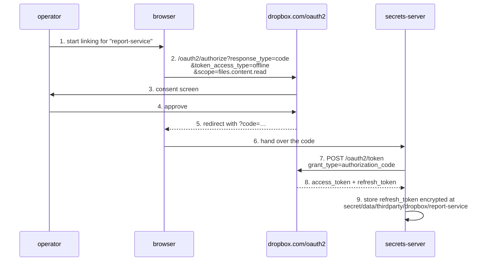
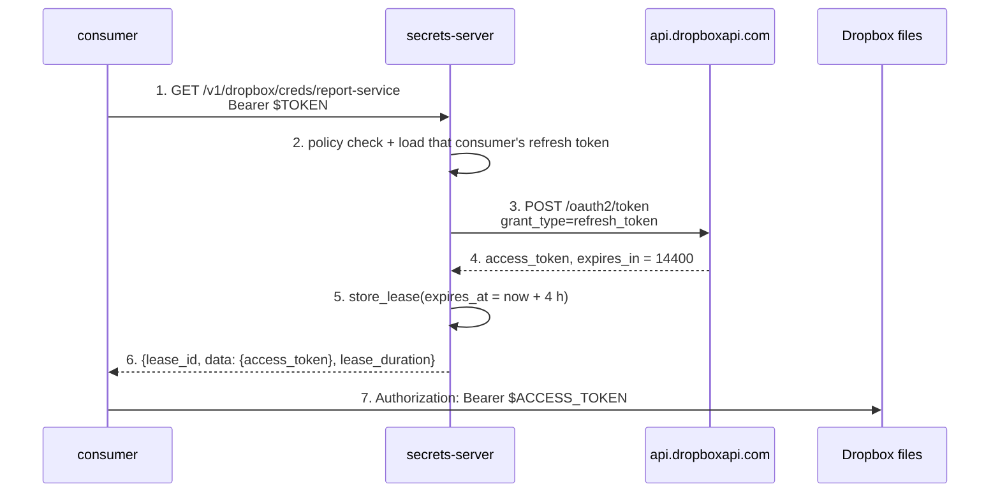
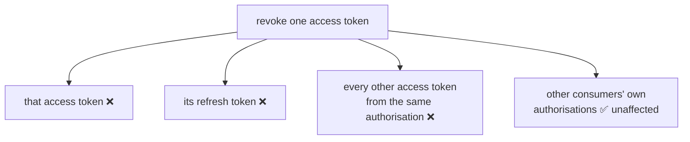
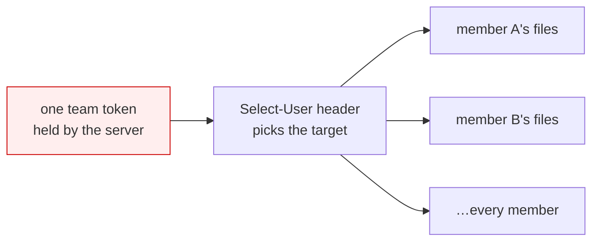

# Dropbox

Delegating Dropbox file access to a consuming microservice.

Dropbox is shape **C** and cannot be anything else: there is no API that mints
a sub-credential. Every token a consumer could use descends from one
long-lived refresh token per authorisation. The server's job is therefore
custody and brokerage — hold the refresh token, hand out four-hour access
tokens — and the isolation between consumers has to come from **separate
OAuth authorisations**, not from anything the server can mint.

- [Mechanisms at a glance](#mechanisms-at-a-glance)
- [Recommended — one authorisation per consumer](#recommended--one-authorisation-per-consumer-shape-c)
- [KV layout](#kv-layout)
- [Revocation](#revocation)
- [Team tokens and why to be careful](#team-tokens-and-why-to-be-careful)
- [Scoping](#scoping)
- [Gotchas](#gotchas)

## Mechanisms at a glance

| Mechanism | Shape | TTL | Scoping | Revocable early? |
|---|---|---|---|---|
| Access token via refresh grant | **C** | **4 h, fixed** | app's scopes; app folder or full Dropbox | **yes** |
| Refresh token | — | no expiry | as above | **yes** |
| Team token + `Select-User` | **C** | 4 h | any team member the header names | yes, but kills all use |

## Recommended — one authorisation per consumer (shape C)

Because nothing can be minted, the unit of isolation is the authorisation
itself. Give each consuming service its own Dropbox app registration, or at
minimum its own authorisation of a shared app, so that revoking one consumer
does not disturb the others.

Linking, once per consumer:



`token_access_type=offline` is the parameter that makes a refresh token appear
at all. Without it you get a four-hour token and no way to renew it. (It also
cannot be combined with the implicit `response_type=token` flow, which errors.)

Then at runtime:



Four hours is fixed — not shortenable, not configurable — which is the longest
non-revocable window in this document apart from AWS's opt-in maxima. The
mitigation is that the token *is* revocable, so a lease revocation actually
does something here.

## KV layout

```
secret/data/thirdparty/dropbox/{consumer}
```

```json
{
  "app_key": "…",
  "app_secret": "…",
  "refresh_token": "…",
  "scopes": ["files.content.read", "files.metadata.read"]
}
```

Dropbox does **not** rotate refresh tokens on use — one refresh token per
authorisation, reused indefinitely — so unlike the Google and Microsoft cases
there is no write-back to design for. The server needs only `read` on this
path to broker access tokens.

## Revocation

```
POST https://api.dropboxapi.com/2/auth/token/revoke
Authorization: Bearer <the token>
```

Authenticate with the token being revoked, send an empty body. The important
detail: **revoking an access token also invalidates the refresh token it came
from** — they are revoked as a set tied to that authorisation.



That cuts both ways. It is genuine revocation, which most providers here
cannot offer — and it means a reaper revoking one consumer's expired lease
will break that consumer's *next* request too, because the refresh token is
gone. Two consequences for the engine:

- **Do not call `revoke` on lease expiry.** Let the four-hour token lapse. Call
  `revoke` only on explicit, deliberate revocation — a compromised consumer, a
  decommissioned service.
- That makes `revoke()` on a Dropbox lease a genuinely destructive operation
  requiring re-consent by a human. Document it as such, and consider requiring
  `sudo` rather than exposing it on the normal lease-revocation path.

## Team tokens and why to be careful

Dropbox Business offers a team-scoped token which, combined with a
`Dropbox-API-Select-User: <team_member_id>` header, lets one credential act as
any member of the team. `Dropbox-API-Select-Admin` similarly acts over
team-owned content.

It is tempting — one credential, every user reachable — and it is the worst
blast radius available:



The header **selects** a target; it does not **reduce** what the token can
reach. There is no way to hand a consumer a team token narrowed to one member.
If a consumer needs one user's files, the per-consumer authorisation above is
the correct answer, and the team token should stay in the server's own custody
for administrative jobs only — if it exists at all.

## Scoping

Two orthogonal axes, both fixed early:

- **Access type** — an *App folder* app is sandboxed to `/Apps/<name>`; a *Full
  Dropbox* app sees everything the user has. This is chosen at app creation and
  **cannot be changed afterwards** — changing it means creating a new app and
  re-linking every consumer. Choose App folder unless you are certain.
- **Scopes** — granular per-permission (`files.content.read`,
  `files.metadata.write`, …), selected on the app and optionally narrowed
  further per authorisation with the `scope` parameter.

There is no per-path scoping beyond App-folder mode.

## Gotchas

- The 4-hour TTL cannot be shortened, including for testing. Expect to wait.
- PKCE exists for clients that cannot hold a secret; a server-side broker
  holding an app secret does not need it, though it does no harm.
- We found no Dropbox mechanism for minting ephemeral per-request
  sub-credentials, and no sign of one being added. If that changes it would
  move Dropbox from shape C to shape A — worth re-checking occasionally, but do
  not design in anticipation.
