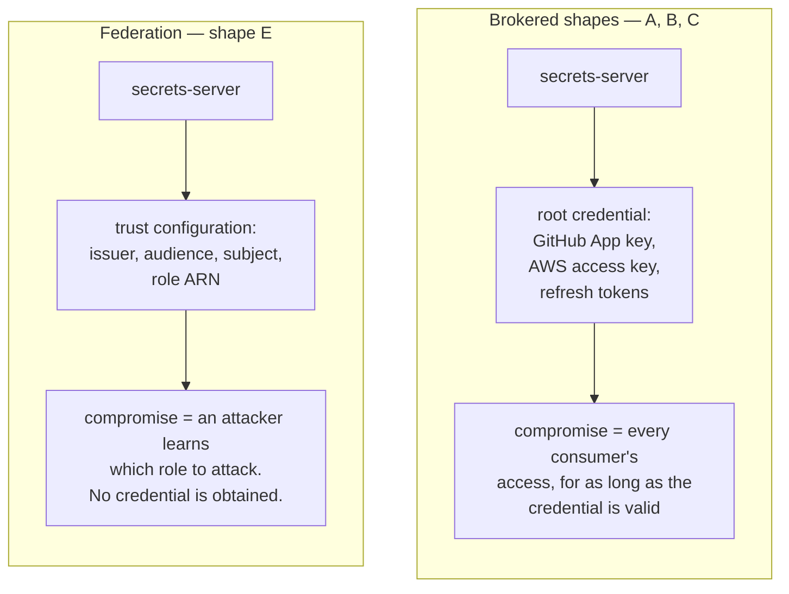
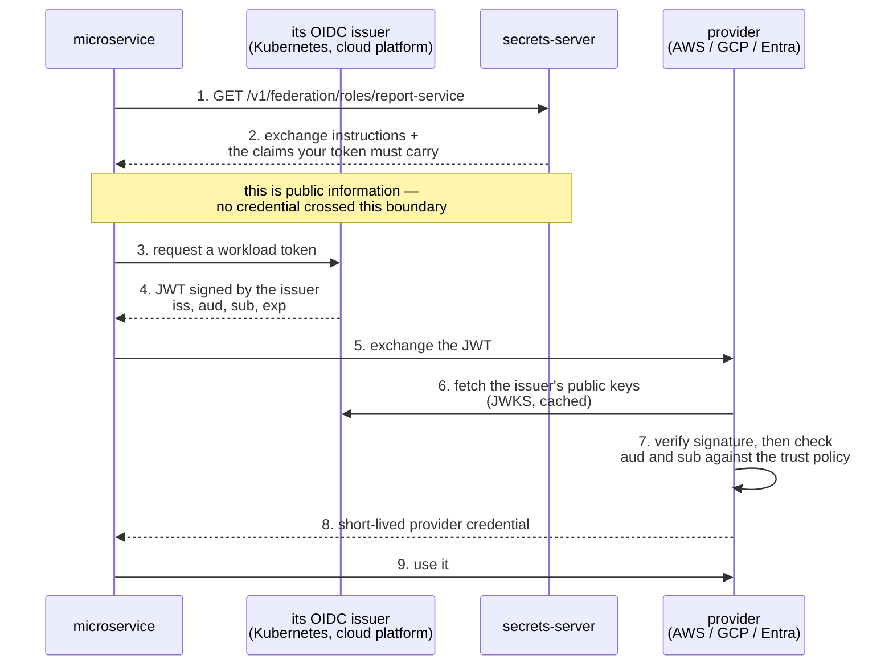
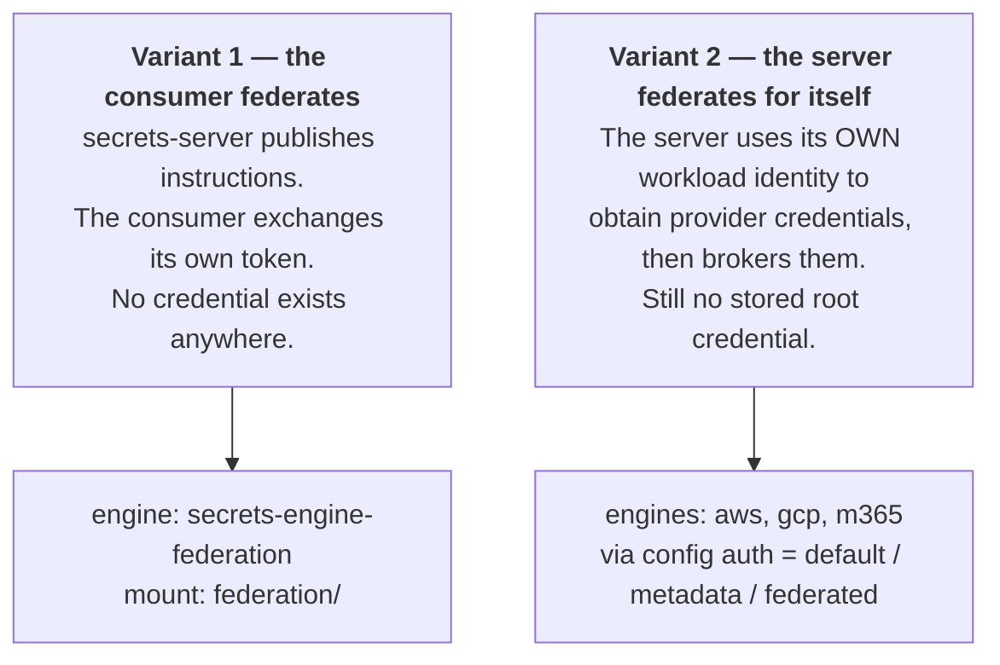
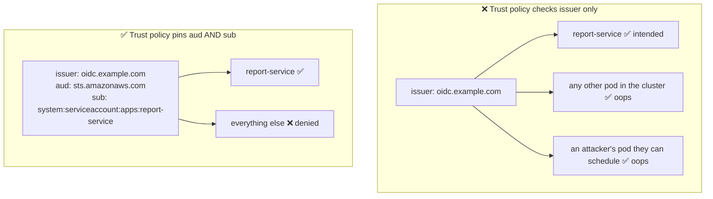
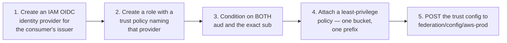
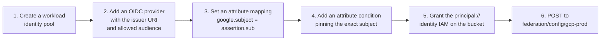
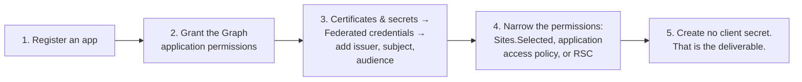
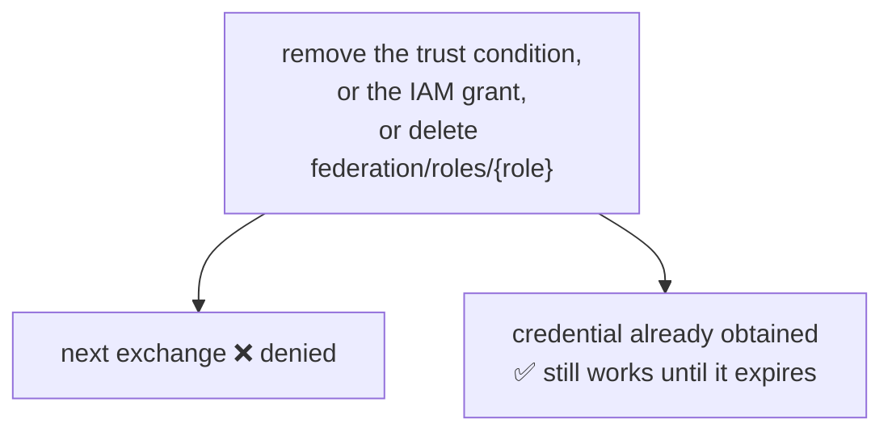

# Federation

The shape where no credential exists.

Every other guide in this directory is about custody: who holds a secret, how
short its life is, and whether it can be destroyed. Federation removes the
question. The provider is configured to trust the consumer's *own* identity, so
there is no credential to mint, store, hand over or leak — and no root
credential on this server whose compromise would be unbounded.

Where a provider supports it, prefer it. This document is longer than the
others because the setup is where federation succeeds or fails, and because one
specific misconfiguration turns it from the safest option into the most
dangerous one.

- [Why it is the strongest shape](#why-it-is-the-strongest-shape)
- [The trust chain](#the-trust-chain)
- [Preconditions](#preconditions)
- [Two variants](#two-variants)
- [The confused-deputy trap](#the-confused-deputy-trap)
- [Setting it up — AWS](#setting-it-up--aws)
- [Setting it up — Google Cloud](#setting-it-up--google-cloud)
- [Setting it up — Microsoft Entra ID](#setting-it-up--microsoft-entra-id)
- [How this server implements it](#how-this-server-implements-it)
- [Withdrawing access](#withdrawing-access)
- [What federation cannot do](#what-federation-cannot-do)

## Why it is the strongest shape

Compare what an attacker gets from compromising the server under each shape:



The trust configuration is not a secret. Publishing it costs nothing, which is
why the federation engine's config is the only engine config in this project
that holds no key material.

The second benefit is auditing. Under brokering, the provider's logs show *the
server* acting; under federation they show the consumer's own identity, so
"who did this?" has an answer without cross-referencing our lease table.

## The trust chain

Federation replaces a shared secret with a chain of verifiable assertions.
Nothing in this diagram is confidential:



Step 7 is the security boundary. The provider is deciding, on its own, that
this particular workload may act. Our server's only contribution was step 2 —
telling the consumer where to go.

## Preconditions

Federation needs three things, and the absence of any one of them sends you
back to a brokered engine:

1. **The consumer must have an OIDC identity of its own.** A Kubernetes
   projected service-account token, an EKS/GKE/AKS workload identity, a CI
   platform's job token. A bare process on a VM with no identity provider has
   nothing to federate.
2. **The provider must accept external OIDC identities.** AWS, Google Cloud and
   Microsoft Entra all do. GitHub, GitLab and Dropbox do not — see
   [What federation cannot do](#what-federation-cannot-do).
3. **The issuer must be reachable by the provider.** The provider fetches JWKS
   over the public internet, so an issuer on a private network cannot be
   verified. This one surprises people running in-cluster issuers.

## Two variants

Federation shows up in two places in this project, and they are worth keeping
distinct:



Variant 1 is the purest and should be the default when the consumer has an
identity. Variant 2 is the fallback when it does not: the consumer still
authenticates to *us* with a token or password, but we no longer hold a
long-lived provider secret — the server's own platform identity replaces it.
Both are strictly better than storing a key.

Concretely, variant 2 is what these config settings select:

| Engine | Setting | Effect |
|---|---|---|
| `aws` | `"auth": "default"` | the AWS provider chain — instance profile, IRSA or ECS task role |
| `gcp` | `"auth": "metadata"` | the GCE metadata server's attached service account |
| `m365` | `"credential": {"type": "federated", …}` | a workload OIDC token read from file, no client secret |

## The confused-deputy trap

This is the one mistake that matters. A trust policy must pin **both** the
audience and the exact subject. Pinning only the issuer, or only the audience,
means any workload that issuer will sign for can assume the role:



Two corollaries people miss:

- **A wildcard in `sub` is a wildcard.** `sub: system:serviceaccount:apps:*`
  trusts every service account in that namespace, which usually means anyone who
  can create a pod there.
- **Audience is not a secret, it is a routing label.** Setting a
  hard-to-guess audience does not compensate for a loose subject; the token is
  handed to the provider, not kept hidden.

The federation engine always reports all three required claims in its
instructions precisely so that an operator reading the output notices if one is
missing.

## Setting it up — AWS



The trust policy is the whole security control:

```json
{
  "Version": "2012-10-17",
  "Statement": [{
    "Effect": "Allow",
    "Principal": { "Federated": "arn:aws:iam::123456789012:oidc-provider/oidc.example.com" },
    "Action": "sts:AssumeRoleWithWebIdentity",
    "Condition": {
      "StringEquals": {
        "oidc.example.com:aud": "sts.amazonaws.com",
        "oidc.example.com:sub": "system:serviceaccount:apps:report-service"
      }
    }
  }]
}
```

Use `StringEquals`, not `StringLike`, unless you genuinely need a pattern — and
if you do, anchor it so it cannot match more than intended.

Register it here:

```bash
curl -X POST "$ADDR/v1/federation/config/aws-prod" \
  -H "Authorization: Bearer $TOKEN" \
  -d '{
    "issuer": "https://oidc.example.com",
    "audience": "sts.amazonaws.com",
    "provider": "aws",
    "role_arn": "arn:aws:iam::123456789012:role/reports-writer",
    "region": "eu-west-3",
    "duration_seconds": 900
  }'

curl -X POST "$ADDR/v1/federation/roles/report-service" \
  -H "Authorization: Bearer $TOKEN" \
  -d '{
    "target": "aws-prod",
    "subject": "system:serviceaccount:apps:report-service"
  }'
```

## Setting it up — Google Cloud



Google gives you a choice the other providers do not, and the less obvious
option is the better one:

- **Grant IAM directly to the federated principal** (`principal://…`) and skip
  impersonation. Fewer moving parts, and Cloud Storage audit logs record the
  original external identity.
- **Impersonate a service account** after the exchange. Needed when a Google
  API will not accept a federated principal, but it hides who really acted
  behind the service account.

Leave `service_account` unset for the first; set it for the second. The engine
emits a one-step or two-step instruction set accordingly.

```bash
curl -X POST "$ADDR/v1/federation/config/gcp-prod" \
  -H "Authorization: Bearer $TOKEN" \
  -d '{
    "issuer": "https://oidc.example.com",
    "audience": "//iam.googleapis.com/projects/1/locations/global/workloadIdentityPools/apps/providers/k8s",
    "provider": "gcp",
    "workload_identity_provider": "//iam.googleapis.com/projects/1/locations/global/workloadIdentityPools/apps/providers/k8s",
    "scope": "https://www.googleapis.com/auth/devstorage.read_only"
  }'
```

## Setting it up — Microsoft Entra ID

Entra calls this a **federated identity credential**, and it is the cleanest of
the three: it is configured in the same place a client secret would be, and its
whole purpose is to not be one.



The audience should be `api://AzureADTokenExchange` unless you have a reason to
differ. Step 4 is not optional: app-only Graph permissions are tenant-wide by
default, so federation fixes the credential problem and leaves the scope
problem entirely to you — see [microsoft-365.md](microsoft-365.md#scoping--the-part-that-actually-matters).

```bash
curl -X POST "$ADDR/v1/federation/config/graph-prod" \
  -H "Authorization: Bearer $TOKEN" \
  -d '{
    "issuer": "https://oidc.example.com",
    "audience": "api://AzureADTokenExchange",
    "provider": "azure",
    "tenant_id": "00000000-0000-0000-0000-000000000000",
    "client_id": "11111111-1111-1111-1111-111111111111"
  }'
```

## How this server implements it

The federation engine is a directory, not a vault. Because it issues nothing,
it deliberately breaks the `{mount}/creds/{role}` convention the other engines
follow:

| Route | Behaviour |
|---|---|
| `GET /v1/federation/roles/{role}` | **the consumer-facing route.** Returns exchange instructions plus the claims the consumer's token must carry. |
| `GET /v1/federation/creds/{role}` | refuses, explaining that nothing is leased and pointing at the route above. |
| `GET /v1/federation/help` | the engine's self-documentation. |

Refusing rather than inventing a lease is the honest choice: a lease is a
promise about a credential's lifetime, and there is no credential here.

A consumer sees this:

```json
{
  "role": "report-service",
  "subject": "system:serviceaccount:apps:report-service",
  "shape": "federation",
  "issued_credential": null,
  "your_token_must_present": {
    "iss": "https://oidc.example.com",
    "aud": "sts.amazonaws.com",
    "sub": "system:serviceaccount:apps:report-service"
  },
  "exchange": {
    "method": "POST",
    "url": "https://sts.eu-west-3.amazonaws.com/",
    "form": {
      "Action": "AssumeRoleWithWebIdentity",
      "RoleArn": "arn:aws:iam::123456789012:role/reports-writer",
      "WebIdentityToken": "${YOUR_OIDC_TOKEN}",
      "DurationSeconds": "900"
    },
    "note": "This call needs no AWS credential — only your own JWT."
  },
  "reminder": "Replace ${YOUR_OIDC_TOKEN} with the JWT your own platform issues. This server never sees it and holds no credential for this provider."
}
```

`issued_credential: null` is deliberate and load-bearing: a client library that
looks for a credential field finds an explicit null rather than an absence it
might misread.

## Withdrawing access

Federation's weak spot. There is no credential to revoke, so withdrawal happens
at the provider and applies to the *next* exchange:



So the containment story is the same as for shapes B and C: keep the credential
the consumer obtains short. Ask for 900 seconds from AWS rather than 12 hours,
and the window between "revoked" and "actually powerless" is fifteen minutes.

Deleting `federation/roles/{role}` here stops us *telling* the consumer where to
go, which is not a security control — a consumer that cached the instructions
can keep exchanging. Treat the provider-side trust policy as the real switch.

## What federation cannot do

- **GitHub and GitLab cannot be federated into.** Both issue OIDC tokens so
  that *their* pipelines can authenticate outward to AWS, GCP or this server.
  Neither offers an endpoint that exchanges an external OIDC token for their own
  API access. For those two, a brokered engine is the only option — see
  [github.md](github.md) and [gitlab.md](gitlab.md).
- **Dropbox and Google Workspace cannot either.** Their models are per-user
  OAuth consent, not workload identity. Use the refresh-broker shape.
- **It does not make credentials revocable.** The provider credential a
  consumer obtains by federating is exactly as un-revocable as the one we would
  have brokered; federation removes the *stored* secret, not the provider's
  limitation.
- **It does not narrow scope by itself.** A federated identity has whatever the
  provider's IAM grants it. Every setup section above ends with "attach a
  least-privilege policy" for that reason.
