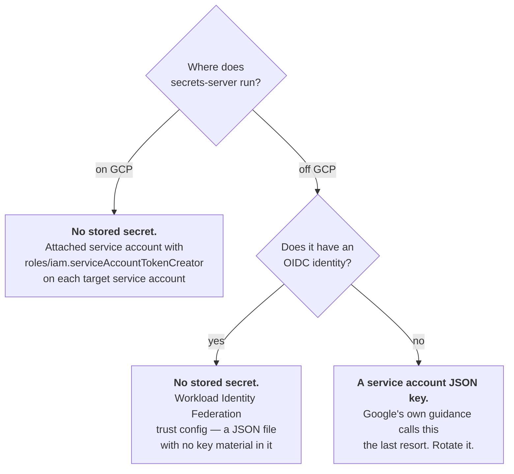
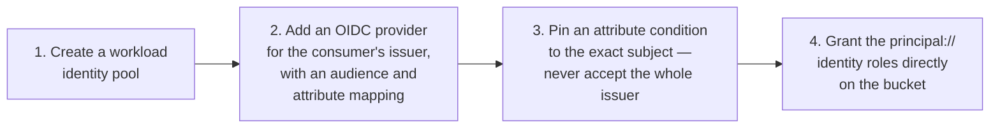
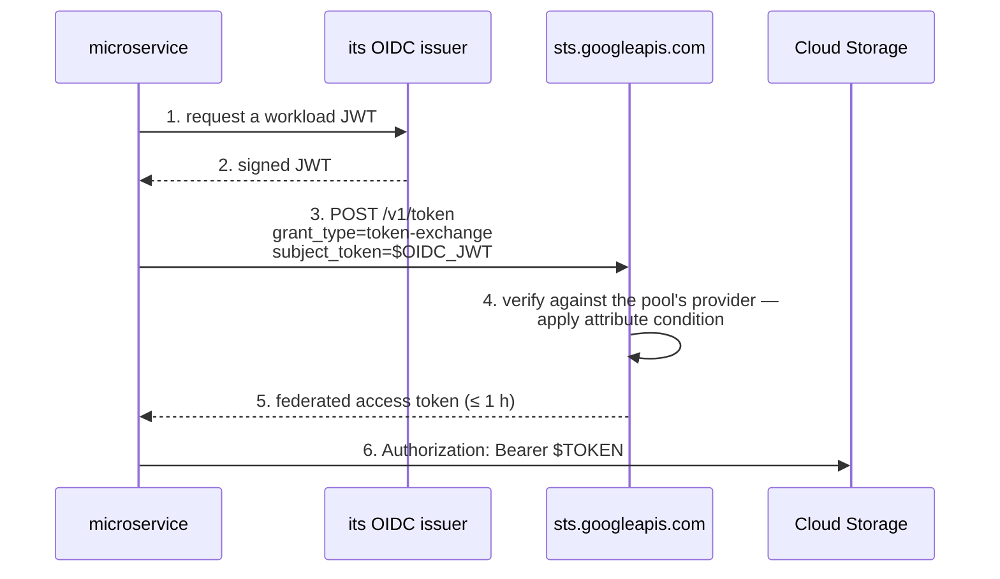
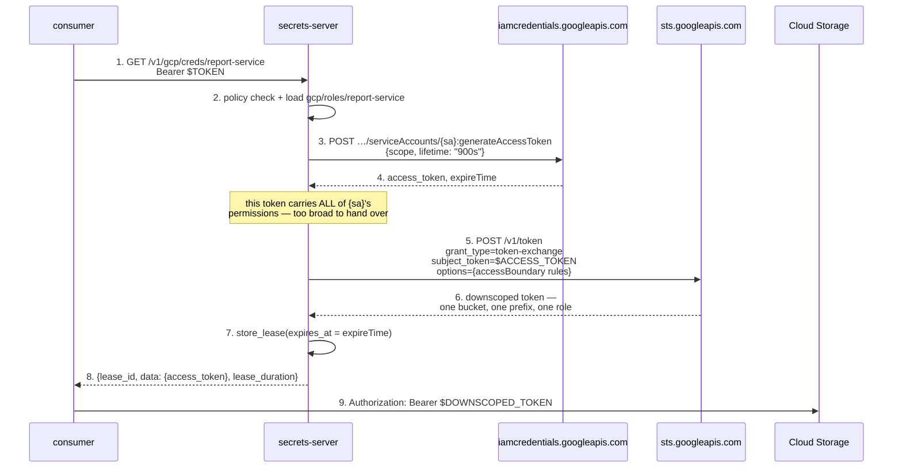
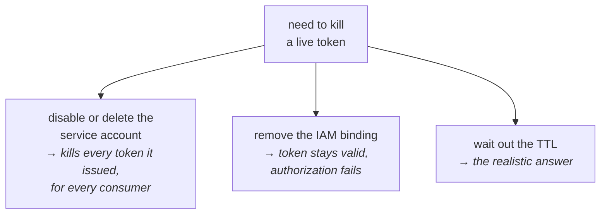

# Google Cloud Storage

Delegating bucket and object access to a consuming microservice.

GCP can mint short-lived credentials and — uniquely among the cloud providers
here — can narrow them down to **a single bucket and prefix** at mint time via
Credential Access Boundaries. What it cannot do is revoke one. So GCP is shape
B with unusually good scoping: lean on narrowness and short TTLs, and be
explicit that a lease revocation does not reach an issued token.

- [Mechanisms at a glance](#mechanisms-at-a-glance)
- [What the server must hold](#what-the-server-must-hold)
- [Preferred — let the consumer federate](#preferred--let-the-consumer-federate-shape-e)
- [Brokered — impersonate, then downscope](#brokered--impersonate-then-downscope-shape-b)
- [Engine sketch](#engine-sketch)
- [Revocation, honestly](#revocation-honestly)
- [HMAC keys — the revocable option](#hmac-keys--the-revocable-option)
- [Signed URLs](#signed-urls)
- [Gotchas](#gotchas)

## Mechanisms at a glance

| Mechanism | Shape | TTL | Scoping | Revocable early? |
|---|---|---|---|---|
| Workload Identity Federation | **E** | ≤ 1 h | IAM on the federated principal | no |
| `generateAccessToken` (impersonation) | **B** | ≤ 1 h, or 12 h by org policy | all of the target service account's IAM | no |
| …plus a Credential Access Boundary | **B** | inherits the token's | **one bucket, optionally one prefix** | no |
| HMAC key | **A** | none — until deleted | the service account's IAM | **yes** |
| V4 signed URL | — | ≤ 7 days | one object, one method | no |

## What the server must hold



A service account key file is a private key that never expires, which is the
thing this architecture exists to avoid. If the server runs anywhere that can
produce an OIDC token, the federation trust config replaces it outright and
stores no key material at all.

## Preferred — let the consumer federate (shape E)

If the consuming microservice has its own OIDC identity, GCP can trust it
directly and this server drops out of the credential path entirely.



Granting IAM **directly to the federated principal** and skipping
impersonation is the better of the two federation variants: fewer moving
parts, and Cloud Storage audit logs record the original external identity
rather than a service account that obscures who really acted.



## Brokered — impersonate, then downscope (shape B)

When the consumer has no federatable identity, the server impersonates a
service account on its behalf, and then — this is the part worth doing —
narrows the resulting token to one bucket and prefix before handing it over.



The boundary rule names the bucket as `available_resource`, the permissions as
`inRole:` entries, and optionally a CEL `availabilityCondition` to restrict to
a prefix:

```json
{
  "accessBoundary": {
    "accessBoundaryRules": [
      {
        "availableResource": "//storage.googleapis.com/projects/_/buckets/reports",
        "availablePermissions": ["inRole:roles/storage.objectViewer"],
        "availabilityCondition": {
          "expression": "resource.name.startsWith('projects/_/buckets/reports/objects/report-service/')"
        }
      }
    ]
  }
}
```

Skipping the downscoping step is the common mistake: a plain impersonated
token inherits *everything* the target service account can do, so without a
boundary you have handed a consumer the whole service account for an hour.

## Engine sketch

```
gcp/config/{target}   # project, how the server authenticates    (Sudo)
gcp/roles/{role}      # service account, bucket, prefix, TTL      (Sudo)
gcp/creds/{role}      # GET → downscoped token + lease            (Read)
```

`gcp/roles/report-service`:

```json
{
  "target": "production",
  "service_account": "reports-reader@acme.iam.gserviceaccount.com",
  "scopes": ["https://www.googleapis.com/auth/devstorage.read_only"],
  "bucket": "reports",
  "prefix": "report-service/",
  "role": "roles/storage.objectViewer",
  "default_ttl_seconds": 900
}
```

Set `Lease.expires_at` from the `expireTime` the IAM Credentials API returns.
`Lease.internal_data` has nothing useful to carry for this shape — there is
nothing to call at revocation time — and that absence is worth a comment in
the engine so the next reader does not assume it was an oversight.

The default maximum lifetime is **1 hour**. Twelve hours is possible but
requires an organisation policy
(`constraints/iam.allowServiceAccountCredentialLifetimeExtension`) listing the
service accounts allowed to do it, and is the wrong direction to move for a
credential you cannot revoke. Note also that the `lifetime` field is
REST-only — `gcloud` does not expose it.

## Revocation, honestly

**An issued service account access token cannot be revoked.** There is no
endpoint for it, nothing tracks outstanding tokens, and `gcloud auth revoke`
only clears local state. The same is true of downscoped tokens and signed URLs.

The only levers, both blunt:



For the engine this means:

- `revoke()` on a `gcp` lease **cannot honour its contract**. It deletes the
  lease record and stops renewal; the token keeps working until `expireTime`.
  Say so in the API response and the engine docs.
- Therefore keep TTLs genuinely short. Fifteen minutes is a reasonable
  default; the hour maximum should be the exception.
- If a consumer's credentials must be individually killable, give each
  consumer **its own target service account** so that disabling it is precise,
  or use HMAC keys below.

## HMAC keys — the revocable option

Cloud Storage HMAC keys are the one credential here with instant revocation:
`hmacKeys.create` mints one, `hmacKeys.update` deactivates it, and
`hmacKeys.delete` removes it (deactivation is required before deletion). The
engine mirrors the Postgres pattern exactly.

The trade-offs are real, though: they never expire on their own, they are
scoped to the **whole service account** with no bucket narrowing, there is a
limit of 10 per service account, and they work only against the S3-compatible
XML API. Use them when revocability matters more than scope, or when the
consumer is an S3-compatible tool that cannot speak Google's native auth.

## Signed URLs

For "read exactly this object" the narrowest option is a V4 signed URL, valid
up to 7 days. The IAM Credentials API's `signBlob` does the signing remotely,
so the server needs no private key locally.

One confusing behaviour to know: signing permission is checked when the URL is
minted, but the **storage** permission is only checked when it is used. A URL
can therefore be minted successfully and still return 403 to the consumer —
which looks like a signing bug and is not.

## Gotchas

- Downscoping works for **Cloud Storage only**. No other GCP service supports
  Credential Access Boundaries, so this document's approach does not
  generalise to the rest of GCP.
- Boundaries only ever subtract permissions; they cannot grant what the
  service account lacks.
- The bucket must have **uniform bucket-level access** enabled for boundary
  conditions to behave.
- A prefix condition that only checks `resource.name.startsWith(...)` will
  permit object reads but break `list`. Listing needs an additional OR'd
  condition on `objectListPrefix` — a documented gotcha that is easy to
  discover only after a consumer complains.
- `generateIdToken` is for proving identity to OIDC-verifying services such
  as Cloud Run or IAP. It is not an access token and will not work against
  Cloud Storage.
