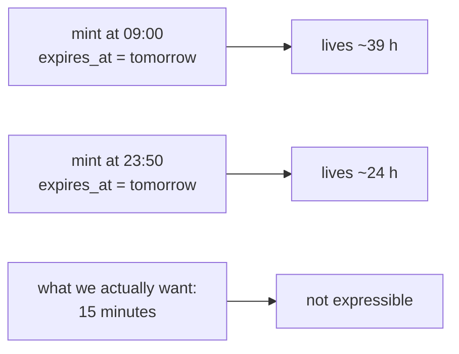
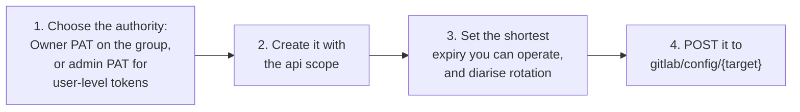
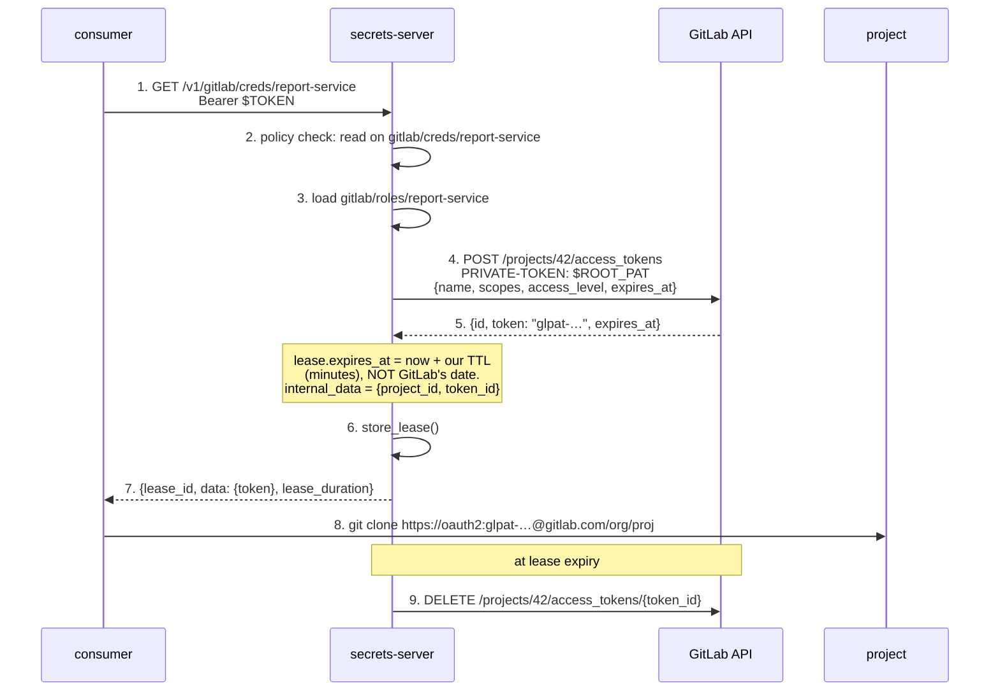

# GitLab

Delegating project and group access to a consuming microservice.

GitLab can mint and revoke tokens through its API, which puts it in shape A —
but with one limitation that shapes the whole design: **expiry has day
granularity**. There is no such thing as a fifteen-minute GitLab access token.
An engine here manages *rotation* on a scale of days, not ephemeral
credentials, and should be built and described with that in mind.

Everything below applies identically to gitlab.com and self-managed unless
noted.

- [Mechanisms at a glance](#mechanisms-at-a-glance)
- [The day-granularity problem](#the-day-granularity-problem)
- [One-time setup](#one-time-setup)
- [How a credential is minted](#how-a-credential-is-minted)
- [Engine sketch](#engine-sketch)
- [Rotation instead of expiry](#rotation-instead-of-expiry)
- [What does not work](#what-does-not-work)
- [Gotchas](#gotchas)

## Mechanisms at a glance

| Mechanism | Shape | TTL | Scoping | Revocable early? |
|---|---|---|---|---|
| Project access token | **A** | 1 day – 1 year, *date only* | one project + scopes + access level | **yes** |
| Group access token | **A** | same | one group + scopes + access level | **yes** |
| Deploy token | **A** | optional, date only | project or group, repo/registry only | **yes** |
| Deploy key | **A** | optional, RFC3339 | one project, read or read-write | **yes** |
| User PAT via admin | **A** | same date-only rules | the user's full reach | **yes** |
| CI job token | — | the job's duration | the triggering user's access | automatic |

## The day-granularity problem

`expires_at` takes a **date**, not a timestamp: a token expires at midnight
UTC on the day given, and the soonest you can ask for is tomorrow. So the
shortest-lived GitLab token is somewhere between a few minutes and 24 hours
old depending on when you mint it — you cannot control which.



Two consequences for the engine:

1. **Set `Lease.expires_at` to the real revocation deadline you want** —
   fifteen minutes, an hour — not to GitLab's midnight date. The reaper then
   calls `DELETE` at that moment and the token dies on our schedule rather
   than GitLab's. GitLab's own `expires_at` becomes a backstop for the case
   where the reaper never runs, which is exactly the right division of labour.
2. Mint with the **nearest possible** `expires_at` anyway, so a lost lease
   record cannot leave a year-long credential behind.

This is the interesting difference from the Postgres engine: there, the
credential has no intrinsic expiry and the reaper is the only clock. Here
there are two clocks, and the tight one should be ours.

## One-time setup

The server needs a long-lived GitLab credential with authority to create
tokens. This is the weak point of the GitLab story — unlike a GitHub App
private key, it is an ordinary token with broad reach.



Prefer an **Owner-level PAT scoped to one group** over an instance admin
token. The admin token can impersonate any user on the instance; the group
Owner token can only mint access within that group. If you need per-user
tokens or impersonation tokens, admin is unavoidable — weigh that against
using project access tokens instead, which need no admin at all.

## How a credential is minted



Revocation needs the **token id**, not the token string, so `internal_data`
carries the id and the project. Revoked tokens are purged from GitLab's own
records after 30 days.

## Engine sketch

```
gitlab/config/{target}   # base URL + the server's root PAT       (Sudo)
gitlab/roles/{role}      # project/group, scopes, level, TTL       (Sudo)
gitlab/creds/{role}      # GET → access token + lease              (Read)
```

`gitlab/config/acme`:

```json
{
  "base_url": "https://gitlab.com/api/v4",
  "private_token": "glpat-…"
}
```

`gitlab/roles/report-service`:

```json
{
  "target": "acme",
  "resource": "project",
  "resource_id": 42,
  "scopes": ["read_repository"],
  "access_level": 20,
  "default_ttl_seconds": 900
}
```

`access_level` is the numeric membership level — 10 Guest, 20 Reporter, 30
Developer, 40 Maintainer (the API default), 50 Owner. It bounds what the token
can do independently of `scopes`, so set both: `scopes` chooses which APIs,
`access_level` chooses how much authority within them.

Useful scopes for consumers: `read_repository` and `write_repository` for git
transport, `read_api` for read-only API access, `read_registry` and
`write_registry` for the container registry. `api` grants everything and is
almost never the right answer for a consumer.

## Rotation instead of expiry

GitLab offers something the other providers here do not: a first-class
rotation endpoint.

```
POST /projects/:id/access_tokens/:token_id/rotate
```

It revokes the old token and returns a new one with the same scopes, defaulting
to a one-week expiry unless you pass `expires_at`. For a long-running consumer
that cannot re-fetch credentials, rotating is gentler than minting a new token
and hoping the consumer notices.

One safeguard to know about: rotating a token that has *already* been revoked
triggers **family-wide revocation** — GitLab treats it as token reuse and
invalidates the whole chain. That is good security and a nasty surprise if the
engine retries a rotation blindly after a failure. Make the rotation path
non-retrying, or re-read state first.

## What does not work

- **CI job tokens** (`CI_JOB_TOKEN`) exist only inside a running pipeline, live
  exactly as long as the job, and cannot be minted from outside. Nothing for an
  engine to do here.
- **GitLab ID tokens** make GitLab an OIDC *issuer* so that pipelines can
  authenticate to AWS, GCP or this very server. Like GitHub's, they point
  outward — there is no exchange that turns an external OIDC token into GitLab
  API access, so GitLab cannot be reached by the federation shape.
- **Deploy tokens cannot call the API at all** — repository and registry only.
  That is a feature when the consumer only pulls images or clones, and a
  surprise if you expected API access.

## Gotchas

- `expires_at` has been **mandatory since GitLab 16.0**; non-expiring tokens no
  longer exist. Omitting it yields 365 days, which is the worst default in this
  document — always set it.
- The maximum lifetime is 365 days, extendable to 400 on recent self-managed
  versions behind a feature flag. Verify the current state on your instance
  rather than assuming; this has moved more than once.
- Creating or rotating a project/group access token must be authenticated with
  a **PAT**, not with the resource token itself.
- Deploy keys are the only credential in the GitLab family whose `expires_at`
  accepts a full RFC3339 timestamp rather than a date. If you need
  sub-day expiry enforced *by GitLab* rather than by our reaper, a deploy key
  is the only option.
- Impersonation tokens are admin-only and self-managed-oriented; their
  availability on gitlab.com is limited and was not confirmed. Do not design
  around them without checking.
