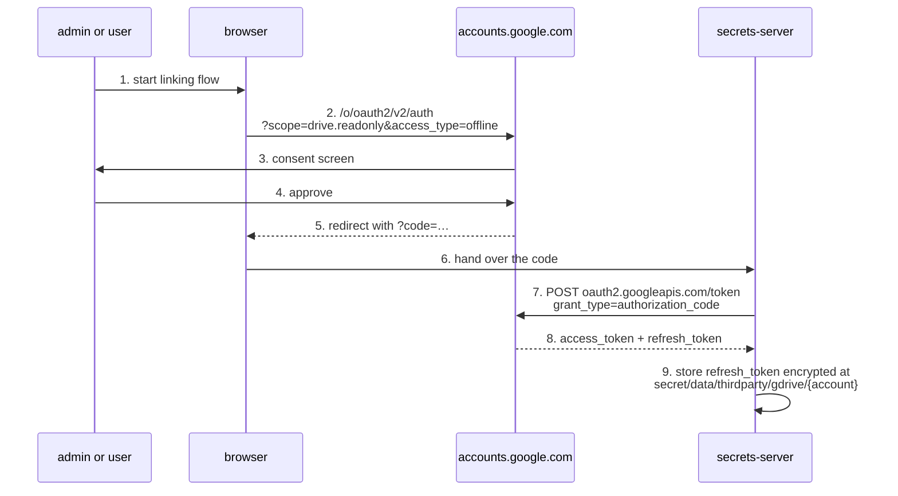
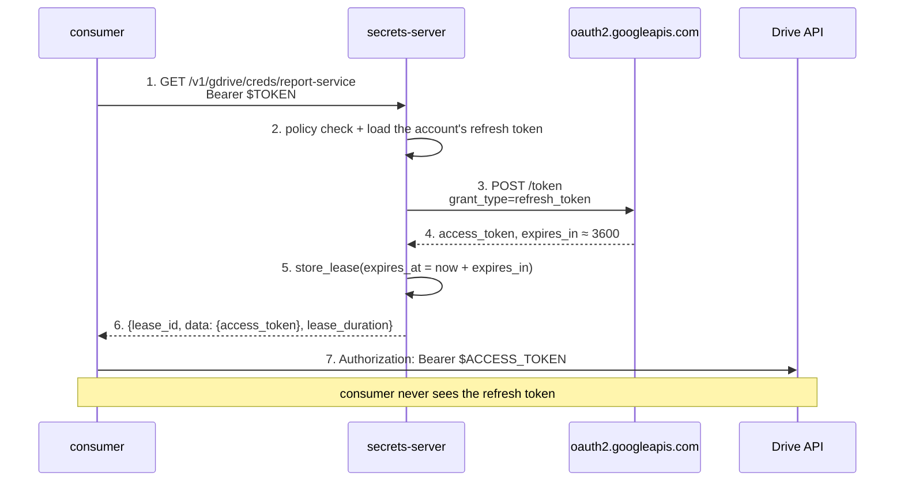
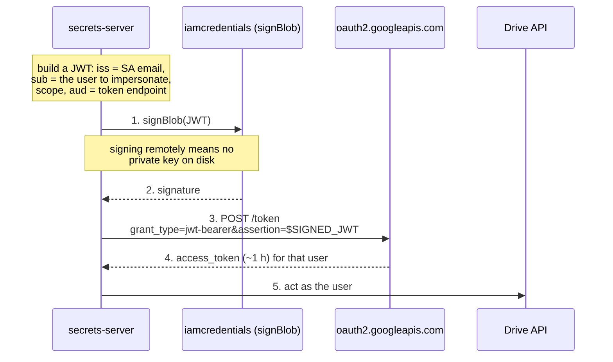

# Google Workspace and Drive

Delegating access to a user's Drive, Gmail or Calendar to a consuming
microservice.

Workspace is a different identity model from Google Cloud and deserves its own
treatment: there is nothing to mint. Access is granted *by a person to an
application*, or *by an administrator across the whole domain*, and neither is
a per-consumer credential. This is shape **C** — the server custodies a
refresh token and hands out only short access tokens — with domain-wide
delegation available as a shape-B alternative that trades an enormous amount
of blast radius for the convenience of not asking users for consent.

- [Mechanisms at a glance](#mechanisms-at-a-glance)
- [Recommended — per-user OAuth with a brokered access token](#recommended--per-user-oauth-with-a-brokered-access-token-shape-c)
- [KV layout](#kv-layout)
- [Alternative — domain-wide delegation](#alternative--domain-wide-delegation-shape-b)
- [Revocation](#revocation)
- [Shared drives](#shared-drives)
- [Gotchas](#gotchas)

## Mechanisms at a glance

| Mechanism | Shape | TTL | Scoping | Revocable early? |
|---|---|---|---|---|
| 3-legged OAuth refresh token | **C** | refresh: long-lived; access: ~1 h | one user, consented scopes | **yes** — `/revoke` |
| Domain-wide delegation | **B** | access: ~1 h | **any user in the domain**, listed scopes | no, per token |
| Marketplace app install | **C/B** | access: ~1 h | admin-installed scopes | via uninstall |

## Recommended — per-user OAuth with a brokered access token (shape C)

One user consents once. The server keeps the refresh token — the durable
secret — and the consumer only ever sees an access token good for about an
hour.

The consent step is interactive and happens once per account:



Thereafter the consumer's path never touches the refresh token:



This is worth building as a small engine even though nothing is "minted" at
Google: the access-token exchange is exactly `generate()`, and keeping the
refresh token on the server side is the entire security benefit. If you would
rather not write an engine, the same effect is achievable with KV plus a
client library on the consumer — but then the consumer holds the refresh
token, and you have gained very little.

## KV layout

If you take the KV route, or for storing the refresh tokens the engine reads:

```
secret/data/thirdparty/gdrive/{account}
```

```json
{
  "client_id": "…apps.googleusercontent.com",
  "client_secret": "…",
  "refresh_token": "1//…",
  "scopes": ["https://www.googleapis.com/auth/drive.readonly"]
}
```

Whoever refreshes needs the `create` capability on that path, not `update` —
`secret_write` checks `Capability::Create`. Google does **not** rotate refresh
tokens on every use, but it may occasionally reissue one near end of life, so
always write back a `refresh_token` if the token response contains one.

## Alternative — domain-wide delegation (shape B)

A service account, authorised once by a super-admin, can impersonate *any*
user in the domain for a fixed list of scopes. No per-user consent, no refresh
tokens to store.



Setup requires a Workspace super-admin to register the service account's
numeric client ID together with a comma-separated scope list under **Security
→ Access and data control → API controls → Domain-wide Delegation**. High
security-posture tenants may additionally require a second super-admin to
approve the entry.

**Understand the blast radius before choosing this.** One authorised service
account can read every mailbox or every Drive file in the domain, for the
granted scopes, with no user able to see or revoke it. Whoever can sign JWTs
as that service account holds that power — which is why the `signBlob`
variant above matters: it keeps the capability behind IAM rather than in a key
file that can be copied.

Google's current guidance is to **avoid domain-wide delegation for new
integrations**, preferring per-user OAuth consent or an admin-installed
Workspace Marketplace app (which provisions scoped permissions without manual
delegation). That is guidance rather than a deprecation — no successor has
been mandated and no sunset announced — but it points the same way this
document does: prefer shape C.

## Revocation

Unlike Google Cloud, the OAuth path here has a real revocation endpoint:

```
POST https://oauth2.googleapis.com/revoke
     token=<the token>&token_type_hint=refresh_token
```

Revoking the refresh token stops all future issuance for that authorisation.
It returns 200 even for an already-invalid token, so it is safe to call
idempotently from a reaper.

The access token itself is a bearer token like any other Google access token
and cannot be individually invalidated — so a lease revocation stops the next
refresh rather than the current hour. With a one-hour access token that is a
reasonable place to land, and it is strictly better than the Google Cloud
situation because the durable half *is* revocable.

Refresh tokens also die on their own in several situations worth handling
rather than being surprised by:

- **Seven days**, if the OAuth consent screen's publishing status is still
  "Testing". This catches out almost everyone once. Publish the app.
- Six months of non-use.
- The user revoking access, or in some cases changing their password.
- Exceeding a per-client-per-user live-token cap, which evicts the oldest.
  Reported figures vary between roughly 50 and 100 and we could not confirm a
  primary source, so treat "many tokens for one user will start evicting each
  other" as the operative fact.

Treat `invalid_grant` on refresh as "the authorisation is gone, a human must
re-consent", not as a transient error to retry.

## Shared drives

Drive access is enforced by ACL membership, which is a separate axis from
OAuth scopes: a service account or impersonated user must be an explicit
**member** of a shared drive to see it, and queries need `corpora=drive` with
the `driveId`. There is a `useDomainAdminAccess=true` flag that bypasses
membership, which is the opposite of least privilege — if you find yourself
reaching for it, add the identity to the drive instead.

## Gotchas

- Scopes are per-user or per-impersonated-user. There is **no per-file or
  per-folder scoping** in the credential; narrowness comes from choosing
  `drive.readonly` or `drive.metadata.readonly` over `drive`, and from Drive
  ACLs.
- The restricted Gmail and Drive scopes require app verification, and the more
  sensitive ones a third-party security assessment. Budget for that before
  designing a product around them.
- Workspace security policy has moved quickly — multi-party approval for
  delegation, assessment requirements for restricted scopes — so re-check the
  admin-side requirements rather than trusting a doc of any age, including this
  one.
