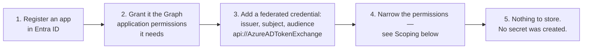
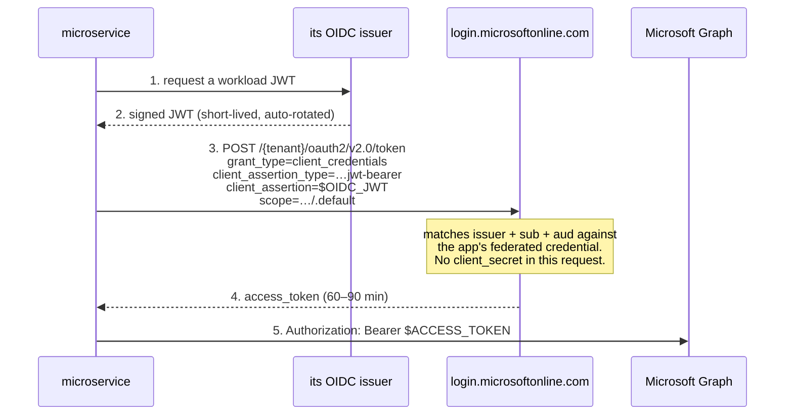
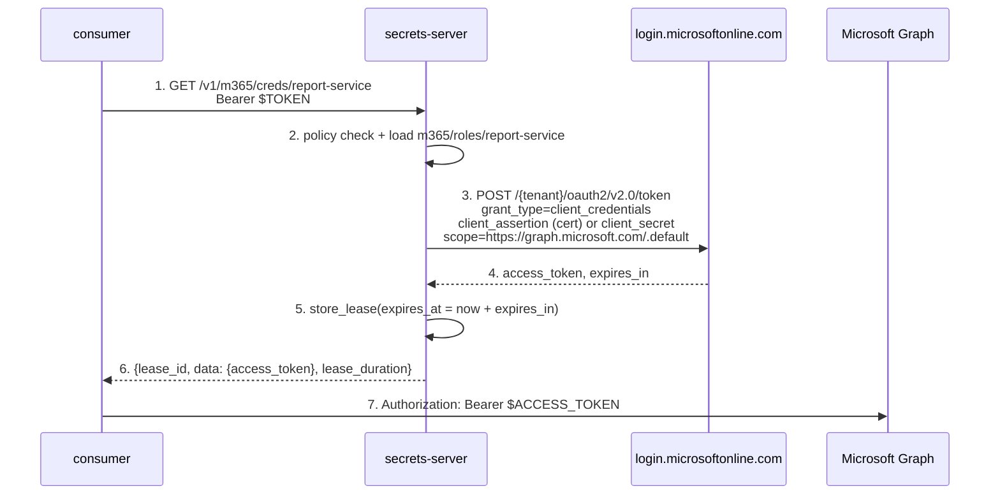
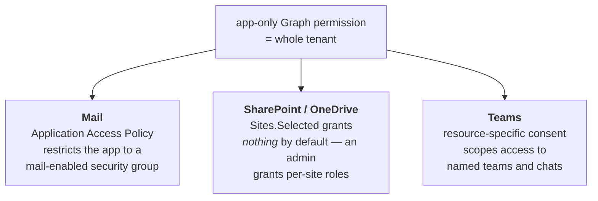

# Microsoft 365

Delegating Microsoft Graph access — mail, files, Teams, SharePoint — to a
consuming microservice.

Microsoft is the one provider here that offers a **completely keyless** path:
a federated identity credential on the app registration lets a microservice
exchange its own OIDC token for a Graph token with no stored secret anywhere.
That makes shape **E** genuinely available, which matters, because
Microsoft's app-only permissions are tenant-wide by default and its access
tokens cannot be revoked. Get the scoping and the identity right and you need
neither of the things Microsoft does badly.

- [Mechanisms at a glance](#mechanisms-at-a-glance)
- [Preferred — federated identity credentials](#preferred--federated-identity-credentials-shape-e)
- [Brokered — client credentials](#brokered--client-credentials-shape-b)
- [Engine sketch](#engine-sketch)
- [Scoping — the part that actually matters](#scoping--the-part-that-actually-matters)
- [Revocation, honestly](#revocation-honestly)
- [Delegated access](#delegated-access)
- [Gotchas](#gotchas)

## Mechanisms at a glance

| Mechanism | Shape | TTL | Scoping | Revocable early? |
|---|---|---|---|---|
| Federated identity credential | **E** | 60–90 min default | app permissions + resource narrowing | no |
| Client credentials — secret or cert | **B** | 60–90 min, 10 min – 24 h via policy | as above | no |
| Delegated + refresh token | **C** | access 60–90 min; refresh 90 days sliding | the user's own rights ∩ consented scopes | refresh: yes |
| On-behalf-of | **C** | as above | the upstream user's identity | refresh: yes |

No flow here issues a refresh token for app-only access: you re-acquire from
the credential each time, which is exactly what an engine wants.

## Preferred — federated identity credentials (shape E)

An Entra ID app registration can trust an external OIDC issuer directly. The
consumer — or this server on its behalf — presents its own workload JWT as a
client assertion, and no client secret exists at all.





The only durable thing is the *trust configuration* on the app registration,
which contains no key material. Compare that with a client secret or
certificate that must be stored, rotated and eventually leaked, and this is
clearly where to start.

## Brokered — client credentials (shape B)

When the consumer has no federatable identity, the server holds a credential
and brokers tokens:



Prefer a **certificate** over a client secret: the assertion is a JWT the
server signs, so the private key never crosses the wire, and certificates
have real expiry semantics. Either way this is a durable secret in
`m365/config/{tenant}` and the reason shape E is worth the setup effort.

Note that `scope` is always `…/.default` for client credentials — the token
carries every application permission the app has been granted and consented
to. You cannot ask for less at request time, which is why narrowing has to
happen at the resource, not in the token request.

## Engine sketch

```
m365/config/{tenant}   # tenant id, client id, cert or secret   (Sudo)
m365/roles/{role}      # which app/tenant, TTL                  (Sudo)
m365/creds/{role}      # GET → Graph access token + lease        (Read)
```

`m365/config/acme`:

```json
{
  "tenant_id": "…",
  "client_id": "…",
  "credential": { "type": "certificate", "private_key_pem": "…" }
}
```

…or `{"type": "federated", "issuer": "…", "subject": "…"}` for the keyless
path, in which case the config holds no secret and could arguably live in
plain KV — though keeping it behind `sudo` with everything else is simpler.

Because app-only tokens come with no refresh token, `generate()` is a single
POST and `Lease.internal_data` again has nothing to carry. Set
`Lease.expires_at` from `expires_in`.

One caching consideration: Entra returns tokens with 60–90 minutes of life
and does not mind being asked repeatedly, but tokens for the same app and
scope are effectively interchangeable. Minting per request is fine and
simplest; caching per role trades a little freshness for fewer round trips.

## Scoping — the part that actually matters

An app-only Graph permission such as `Mail.Read` or `Files.Read.All` applies
to **the entire tenant** — every mailbox, every site. That is not a credential
you hand to a report generator. Microsoft provides per-resource narrowing, and
using it is not optional:



- **Mail** — `New-ApplicationAccessPolicy` binds the app ID to a mail-enabled
  security group with `RestrictAccess` or `DenyAccess`. Propagation can take
  over an hour, so test with patience. Microsoft is moving this toward RBAC for
  Applications, which is *additive* — it does not remove the tenant-wide Entra
  grant, so you must remove that separately for the narrowing to mean anything.
- **SharePoint and OneDrive** — `Sites.Selected` is the one to reach for: it
  grants access to zero sites until an admin explicitly grants a role
  (`read`/`write`/`manage`/`fullControl`) per site via
  `POST /sites/{siteId}/permissions`. Known gap: the Graph **Search** API
  queries a tenant-wide index and bypasses `Sites.Selected`, so search is not
  covered by this narrowing.
- **Teams** — resource-specific consent scopes an app to named teams or chats
  rather than the tenant. This surface has changed repeatedly; verify the
  current capability against Microsoft's docs before relying on specifics.

## Revocation, honestly

**An issued Graph access token cannot be revoked.** There is no API for it.
What exists:

- `revokeSignInSessions` invalidates a user's **refresh tokens** and browser
  sessions, forcing re-authentication for future token acquisition. It does
  nothing to a live access token, and takes a few minutes to propagate. (The
  beta `invalidateAllRefreshTokens` is deprecated in its favour.)
- **Continuous Access Evaluation** is the only near-real-time mechanism, and
  it is conditional: it reacts to critical events — user disabled or deleted,
  password reset, network location change — typically within about fifteen
  minutes, and only when **both** the resource and the client are CAE-capable,
  with the client advertising the `cp1` capability. Exchange, SharePoint, Teams
  and Graph support it as resources; many clients never request CAE tokens.
  CAE-eligible tokens are also *longer*-lived (up to 24–28 hours) precisely
  because they can be re-evaluated — which makes the non-CAE path worse than
  it looks if you assumed the 60–90 minute figure held everywhere.

For the engine:

- `revoke()` on an `m365` lease **cannot honour its contract** for app-only
  credentials. It deletes the lease and stops renewal.
- Keep the Configurable Token Lifetime policy in mind as the real control: the
  minimum is **10 minutes**, the maximum 23:59:59. Ten minutes for a brokered
  consumer credential is a defensible choice given that revocation is
  unavailable.
- For delegated access, `revokeSignInSessions` gives you a genuine kill switch
  on the durable half, as with Google.

## Delegated access

If the consumer must act as a *user* rather than as an application, the
delegated flow applies and the picture becomes shape C: the server stores a
refresh token and hands out access tokens.

Two differences from Google worth noting. Microsoft **rotates the refresh
token on every use** and does not automatically revoke the old one, so the
server must write back the new refresh token on every exchange — miss that and
you will be debugging intermittent `invalid_grant` failures. And the refresh
token's 90-day lifetime is a *sliding window* that resets on each successful
use, so an actively-used authorisation effectively never expires, while an
idle one dies quietly (24 hours instead of 90 days if the app's redirect URI is
registered as `spa`).

The **on-behalf-of** flow is the variant for a mid-tier API that received a
user's token and must call Graph carrying that identity. It needs an inbound
user token as the assertion, so it does not apply to a backend job with no
upstream request — which is most consumers of this server.

## Gotchas

- Access token TTL is randomised between 60 and 90 minutes by default
  (averaging ~75). Do not hard-code 3600; read `expires_in`.
- `.default` is the only usable scope for client credentials — it means "every
  permission already consented for this app", so the app registration *is* the
  scope boundary.
- Admin consent is required for application permissions. A consumer waiting on
  an unconsented permission fails with an authorisation error that does not
  obviously say "nobody clicked approve".
- Application Access Policy propagation exceeding an hour makes
  `Sites.Selected`-style per-resource grants much more pleasant to operate for
  files than the mail equivalent.
