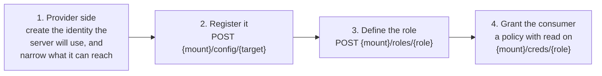

# Setup guides

Operator runbooks for each engine. Every guide follows the same four steps, so
once you have done one the rest are familiar.



| Guide | Mount | Shape |
|---|---|---|
| [GitHub](github.md) | `github/` | A — mint and revoke |
| [GitLab](gitlab.md) | `gitlab/` | A — mint and revoke |
| [AWS](aws.md) | `aws/` | B, or A with `iam_user` |
| [Google Cloud Storage](gcp-storage.md) | `gcp/` | B, or A with `hmac` |
| [Google Workspace](google-workspace.md) | `gworkspace/` | C — refresh broker |
| [Dropbox](dropbox.md) | `dropbox/` | C — refresh broker |
| [Microsoft 365](microsoft-365.md) | `m365/` | B |
| [Federation](../federation.md#setting-it-up--aws) | `federation/` | E — nothing stored |

## Before you start

Every command below assumes an address and an admin token:

```bash
export ADDR=https://secrets.example.com
export TOKEN=$(curl -s -X POST "$ADDR/v1/auth/userpass/login" \
  -d '{"username":"admin","password":"..."}' | jq -r .auth.client_token)
```

## Ask the server, not the docs

The server documents itself, so you do not have to trust this directory to be
current. Start here:

```bash
curl -s "$ADDR/v1/sys/help" -H "Authorization: Bearer $TOKEN" | jq
```

That lists every mounted engine, its shape, and whether its credentials can be
revoked. Then ask an engine directly:

```bash
curl -s "$ADDR/v1/github/help" -H "Authorization: Bearer $TOKEN" | jq
```

which returns its mechanism, TTL envelope, scoping, what root credential it
needs, every path it answers, and its caveats. The `help` endpoints need only a
valid token — no capability — precisely so a consumer can look up what its own
credential is worth.

## The consumer's policy

One role per consumer, and a policy granting `read` on just that path:

```bash
curl -X POST "$ADDR/v1/sys/policy/report-service" \
  -H "Authorization: Bearer $TOKEN" \
  -d '{"rules":[
        {"prefix":"github/creds/report-service","capabilities":["read"]}
      ]}'
```

Policy is longest-prefix-match and deny-by-default, so this consumer cannot
reach another role's credentials, the role definitions, or the root credential.

Note that `{mount}/config/{target}` requires `sudo` and is **write-only**: a
`GET` reports whether it is configured but never returns the document, because
it holds the provider root credential.

## What a consumer sees

```bash
curl -s "$ADDR/v1/github/creds/report-service" -H "Authorization: Bearer $CONSUMER_TOKEN" | jq
```

```json
{
  "lease_id": "8f14e45f-ceea-467a-9f8c-2c0f1e0a1f3b",
  "data": { "token": "ghs_...", "git_clone_username": "x-access-token" },
  "lease_duration": 3600,
  "_doc": {
    "shape": "mint-and-revoke",
    "revocable": true,
    "revoke_effect": "DELETE /installation/token, authenticated with the leased token itself — the credential stops working immediately. ...",
    "scoped_to": ["repo:reports", "contents:read", "pull_requests:write"],
    "expires_at": "2026-09-22T13:04:11Z",
    "help": "/v1/github/help",
    "revoke": "/v1/sys/leases/revoke/8f14e45f-ceea-467a-9f8c-2c0f1e0a1f3b"
  }
}
```

`_doc` is the part worth reading in code review. `revocable` answers one narrow
question — *if I revoke this lease, does the credential stop working?* — and
only shape A can answer yes. For the others `revoke_effect` says plainly what
does and does not happen, which is why the wording matters more than the flag.
